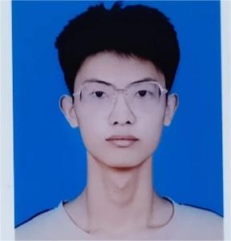

  

<h1 align="center">魏鑫浩</h1>

  🎓 青岛科技大学 · 机械工程（本科）· 辅修人工智能 
  📧 <a href="mailto:202587244@qq.com">202587244@qq.com</a> · 📍 山东青岛

---

## 🎓 教育背景

### 主修
| 项目 | 详情 |
|------|------|
| **学校** | 青岛科技大学 |
| **专业** | 机械工程（本科） |
| **时间** | 2023.09 — 2027.06（预计） |
| **GPA** | 3.0 / 4.0 |
| **学号** | 2305070118 |

### 辅修 / 自学
| 项目 | 详情 |
|------|------|
| **方向** | 人工智能 |
| **内容** | Python · 机器学习 · 深度学习 · NLP · 计算机视觉 |
| **时间** | 2024 — 至今 |

---

## 📚 修读课程

### ⚙️ 机械工程核心课程
`机械制图` `工程力学` `电工技术` `材料力学` `机械原理` `机械设计` `机械制造基础` `液压传动与控制` `控制工程基础` `互换性与技术测量` `工程材料与热处理` `数控技术`

### 🔬 数学与基础课程
`高等数学` `大学物理` `线性代数` `概率论与数理统计` `计算机基础`

### 🔧 实践课程
`金工实习` `电工实习` `机械原理课程设计` `机械设计课程设计` `生产实习`

### 🤖 人工智能相关课程（辅修）
`Python 程序设计` `数学建模` `人工智能` `机器学习` `深度学习` `计算机视觉` `自然语言处理` `智能推荐技术` `大数据模型与应用` `网络爬虫与信息提取` `数据可视化`

---

## 💻 专业技能

### 机械工程
`AutoCAD / 机械制图` `SolidWorks` `PLC 编程` `MATLAB` `数控编程` `有限元分析`

### 编程与开发
`Python` `C/C++` `SQL` `Git / GitHub` `MySQL / MongoDB`

### 人工智能与数据科学
`机器学习` `深度学习` `PyTorch` `TensorFlow` `NLP` `计算机视觉` `数据可视化` `大模型应用`

---

## 📂 项目与课程设计

### ⚙️ 机械工程

#### PLC 梯形图设计与应用 | 独立完成 · *2024*
- 使用 PLC 编程实现工业控制逻辑，设计并绘制梯形图
- 掌握可编程控制器的基本原理及其在自动化中的应用

#### 机械原理 / 机械设计课程设计 | 独立完成 · *2025 — 2026*
- 完成机构运动方案设计与分析
- 使用 CAD 软件进行机械零部件建模与工程图绘制

#### 金工实习 / 电工实习 | 实践课程 · *2024 — 2025*
- 车、铣、刨、磨、钳等传统机械加工操作训练
- 电工基本技能训练，掌握电路安装与调试

### 🤖 人工智能（辅修）

#### Python 程序设计大作业 | 独立完成 · *2024*
- 基于 Python 的综合性项目开发，涵盖数据处理与交互功能实现

#### 网络爬虫与信息提取 | 独立完成 · *2024*
- 使用 Scrapy / Requests 框架实现网页数据采集与结构化提取

#### 智能图像处理项目 | 独立完成 · *2025*
- 基于 CNN 的图像分类/目标检测实践，使用 PyTorch 训练与调优

#### NLP 与大数据模型应用 | 独立完成 · *2025*
- 文本分类、情感分析等 NLP 任务实践，探索大模型应用与微调

---

## 🏆 获奖情况（共 17 项）

### 🥇 国家级奖项（4 项）

| 竞赛名称 | 时间 | 奖项 | 角色 |
|----------|------|------|------|
| 中国高校智能机器人创意大赛 | 2024.08 | **二等奖** | 项目负责人 |
| 国际大学生智能农业装备创新大赛 | 2025.05 | **二等奖** | 核心队员 |
| 中国机器人及人工智能大赛 | 2025.08 | **三等奖** | 项目负责人 |
| 全国大学生节能减排社会实践与科技竞赛 | 2025.08 | **三等奖** | 核心队员 |

### 🥈 省级奖项（13 项）

| 竞赛名称 | 时间 | 奖项 | 角色 |
|----------|------|------|------|
| 中国高校智能机器人创意大赛 | 2024.07 / 2025.07 | 一等奖 ×1 + 二等奖 ×2 | 负责人/队员 |
| 全国大学生节能减排社会实践与科技竞赛 | 2024 | 一等奖 + 三等奖 | 负责人/队员 |
| 山东省大学生科技节系列竞赛 | 2024.10 / 2024.11 | 一等奖 + 二等奖 | 队员 |
| iCAN大学生创新创业大赛 | 2024.10 / 2025.10 | 二等奖 + 三等奖 | 负责人/队员 |
| 山东省大学生创客大赛 | 2024.10 | **二等奖** | 项目负责人 |
| 全国大学生机械创新设计大赛 | 2025.08 | **二等奖** | 核心队员 |
| 中国机器人及人工智能大赛 | 2024.06 | 三等奖 | 项目负责人 |
| 山东省大学生创新方法大赛 | 2024.12 | 三等奖 | 核心队员 |

---

## 📝 自我评价

青岛科技大学机械工程专业在读本科生，具有扎实的机械工程理论基础和实践能力，熟悉机械制图、机械设计、材料力学等核心课程，具备金工实习、电工实习等工程实践经历。

同时辅修人工智能方向，系统学习了 Python 编程、机器学习、深度学习、自然语言处理、计算机视觉等技术，具备跨学科融合的思维和能力。

积极参加各类科技创新竞赛，累计获得**国家级奖项 4 项、省级奖项 13 项**，多次担任项目负责人，具备良好的团队协作能力和项目管理经验。对智能制造、工业大数据、机器人技术等前沿交叉领域有浓厚兴趣，希望在研究生阶段深入探索机械工程与人工智能的交叉方向。

---

  <i>感谢阅读，期待进一步交流！</i>

